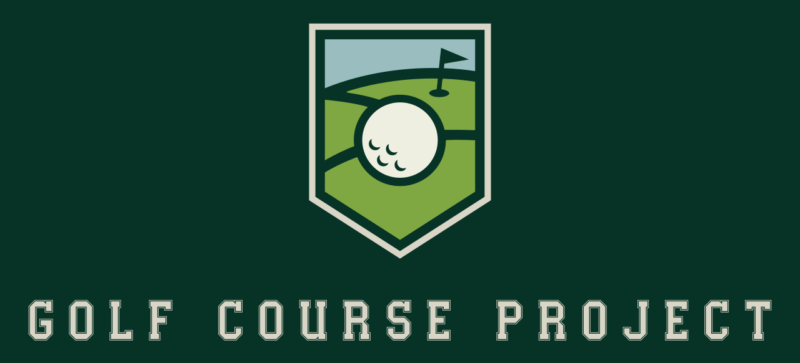

# Golf Course Project

> 📣 It's summer time and we are busy golfing. We will pick this project back up in the fall of 2025.

## About The Golf Course Project

The Golf Course Project is a comprehensive platform designed to help golf enthusiasts discover, rank, and explore the best public golf courses across the United States. Our mission is to provide open and accessible data on golf courses, making it easier for golfers to find quality courses based on value, experience, and overall merit.

🌐 **Website:** https://www.golfcourseproject.com/

## Features

### 🏌️ Course Rankings & Reviews
- Curated lists of the best public golf courses organized by state
- Detailed reviews, ratings, and value assessments
- Help golfers choose their next destination with confidence
- Rankings based on quality, experience, and value

### 📊 Golf Course Data
- Open and accessible data on golf courses across the United States
- Course rankings and ratings
- Location details and relevant information for each course
- Perfect for planning golf trips and discovering new courses

### 👤 User Accounts & Profiles
- Create and manage personal golf profiles
- Track courses you've played
- Save your favorite courses
- Contribute reviews and ratings
- Manage personal golfing statistics

### 🛠️ Admin Tools
- Administrative dashboard for managing course data
- User and session management
- System data oversight
- Course rankings and ratings management

## Architecture

The Golf Course Project is built with a modern microservices architecture:

### Public Repositories

- **[Admin Web App](https://github.com/Golf-Course-Project/admin-webapp)** - React front end for admin level tasks

### Private Repositories

- **User Service** - Create accounts and manage user profiles
- **Admin Service** - Managing users, sessions, and system data
- **Identity Service** - Security, user authentication, tokens, and sessions
- **Course Service** - Golf courses, course rankings, and course ratings

## Technology Stack

- **Frontend:** React
- **Backend:** Microservices architecture
- **Data:** Open and accessible golf course database

## Contributing

We welcome contributions from the golf community! Whether you're a developer, golf enthusiast, or both, there are many ways to get involved:

- Report bugs and issues
- Suggest new features
- Contribute course data and reviews
- Help improve our documentation

## Links

- 🌐 [Website](https://www.golfcourseproject.com/)
- 💼 [Organization](https://github.com/Golf-Course-Project)
- 📱 [Admin Web App](https://github.com/Golf-Course-Project/admin-webapp)

---

*Built with ❤️ by golfers, for golfers*